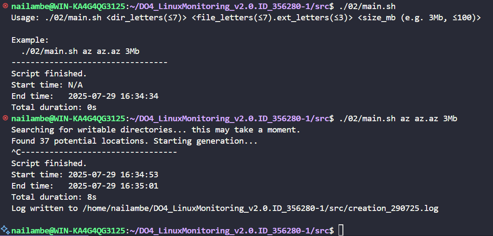

# Linux Monitoring Report

This report details the steps taken to complete the tasks for the Linux Monitoring project.

## Part 1: File generator

### Task

Write a bash script to generate files and folders with specific naming conventions and size constraints. The script should stop if the free disk space drops below 1GB. A log file should be created with details of all created files and folders.

### Implementation

The `01/main.sh` script was created to solve this task.

**Script usage:**
```bash
./01/main.sh [absolute_path] [num_subfolders] [folder_letters] [num_files] [file_letters.extension_letters] [file_size_kb]
```

**Example:**
```bash
./01/main.sh /opt/test 4 az 5 az.az 3kb
```

The script performs the following actions:
1.  Validates the input parameters.
2.  Generates folder names with the specified letters and the current date.
3.  Generates file names with the specified letters and the current date.
4.  Creates files with the specified size.
5.  Checks for available disk space and stops if it's less than 1GB.
6.  Logs all created files and folders in `part1.log`.

[Screenshot of the script in action]  


[Screenshot of the generated files and folders]  


[Screenshot of the log file]  


## Part 2: File system clogging

### Task

Write a bash script to create a large number of files and folders in random locations on the file system to simulate a disk-clogging scenario. The script should stop when the free disk space is 1GB.

### Implementation

The `02/main.sh` script was created for this purpose.

**Script usage:**
```bash
./02/main.sh [folder_letters] [file_letters.extension_letters] [file_size_mb]
```

**Example:**
```bash
./02/main.sh az az.az 3Mb
```

The script performs the following actions:
1.  Generates folder names with the specified letters and the current date.
2.  Creates up to 100 subfolders in random locations (avoiding `/bin` and `/sbin`).
3.  Creates a random number of files in each folder.
4.  Checks for available disk space and stops if it's less than 1GB.
5.  Logs all created files and folders in `part2.log`.
6.  Records the start and end time of the script and calculates the total execution time.

[Screenshot of the script in action]  


[Screenshot of the log file with execution time]  


## Part 3: Cleaning the file system

### Task

Write a bash script to clean up the files and folders created in Part 2. The script should support three cleaning methods: by log file, by creation date and time, and by name mask.

### Implementation

The `03/main.sh` script was created to clean the file system.

**Script usage:**
```bash
./03/main.sh [1|2|3]
```

The script supports the following cleaning methods:
1.  **By log file:** Deletes all files and folders listed in `part2.log`.
2.  **By creation date and time:** Prompts the user to enter a start and end date/time and deletes all files created within that interval.
3.  **By name mask:** Deletes files and folders based on a name mask (e.g., `ddmmyy_...`).

[Screenshot of the cleaning script in action - Method 1]  


[Screenshot of the cleaning script in action - Method 2]  


[Screenshot of the cleaning script in action - Method 3]  


## Part 4: Log generator

### Task

Write a bash script or a C program to generate 5 Nginx log files in the combined format. Each log should contain information for one day with a random number of entries (100-1000).

### Implementation

The `04/main.sh` script was created to generate the Nginx logs.

The script generates 5 log files (`access_YYYY-MM-DD.log`) with the following randomized data for each entry:
*   IP address
*   Response code (200, 201, 400, 401, 403, 404, 500, 501, 502, 503)
*   HTTP method (GET, POST, PUT, PATCH, DELETE)
*   Timestamp
*   Request URL
*   User-Agent

[Screenshot of the generated log files]  


## Part 5: Monitoring

### Task

Write a bash script to parse the Nginx logs generated in Part 4 using `awk`. The script should provide different views of the data based on a command-line parameter.

### Implementation

The `05/main.sh` script was created to parse the logs.

**Script usage:**
```bash
./05/main.sh [1|2|3|4]
```

The script provides the following information:
1.  All entries sorted by response code.
2.  All unique IPs.
3.  All requests with errors (4xx or 5xx response codes).
4.  All unique IPs from erroneous requests.

[Screenshot of the script output - Option 1]  


[Screenshot of the script output - Option 2]  


[Screenshot of the script output - Option 3]  


[Screenshot of the script output - Option 4]  


## Part 6: GoAccess

### Task

Use the GoAccess utility to analyze the generated Nginx logs and view the results in a web interface.

### Implementation

GoAccess was used to generate an HTML report from the log files.

**Command:**
```bash
goaccess access_*.log -o report.html --log-format=COMBINED
```

The generated `report.html` provides an interactive dashboard to explore the log data.

[Screenshot of the GoAccess HTML report]  


## Part 7: Prometheus and Grafana

### Task

Install and configure Prometheus and Grafana to monitor system metrics. Create a Grafana dashboard to display CPU, RAM, disk space, and I/O operations.

### Implementation

1.  Prometheus and Grafana were installed and configured.
2.  Node Exporter was installed to collect system metrics.
3.  A new Grafana dashboard was created to visualize the following metrics from Prometheus:
    *   CPU Usage
    *   Available RAM
    *   Free Disk Space
    *   Disk I/O Operations
4.  The script from Part 2 was executed to generate load on the system.
5.  The `stress` utility was used to generate CPU, memory, and I/O load.

[Screenshot of the Prometheus]  


[Screenshot of the Grafana dashboard under load]  


## Part 8: A ready-made dashboard

### Task

Import a pre-built Grafana dashboard and use it to monitor the system under load, including network load.

### Implementation

1.  The "Node Exporter Quickstart and Dashboard" was imported from the official Grafana Labs website.
2.  The same load tests from Part 7 were performed.
3.  `iperf3` was used to generate network load between two virtual machines.

[Screenshot of the iperf3 testing environment]  


[Screenshot of the dashboard under network load]  


## Part 9: Bonus. Your own node_exporter

### Task

Create a custom script to collect basic system metrics (CPU, RAM, disk) and expose them in a Prometheus-compatible format on an HTML page served by Nginx.

### Implementation

1.  The `09/main.sh` script was created to collect CPU, RAM, and disk usage.
2.  The script generates an `index.html` file in the Prometheus metrics format.
3.  Nginx was configured to serve this `index.html` file.
4.  A cron job was set up to run the script every 3 seconds to refresh the metrics.
5.  Prometheus was configured to scrape the metrics from the custom endpoint.
6.  The same load tests from Part 7 were performed.

[Screenshot of the custom metrics page]  


[Screenshot of Grafana with custom metrics]  

